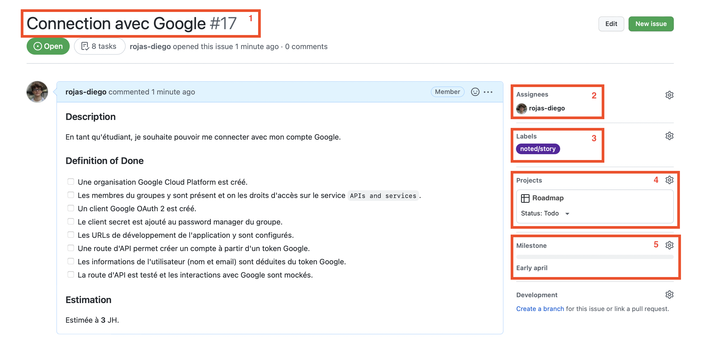
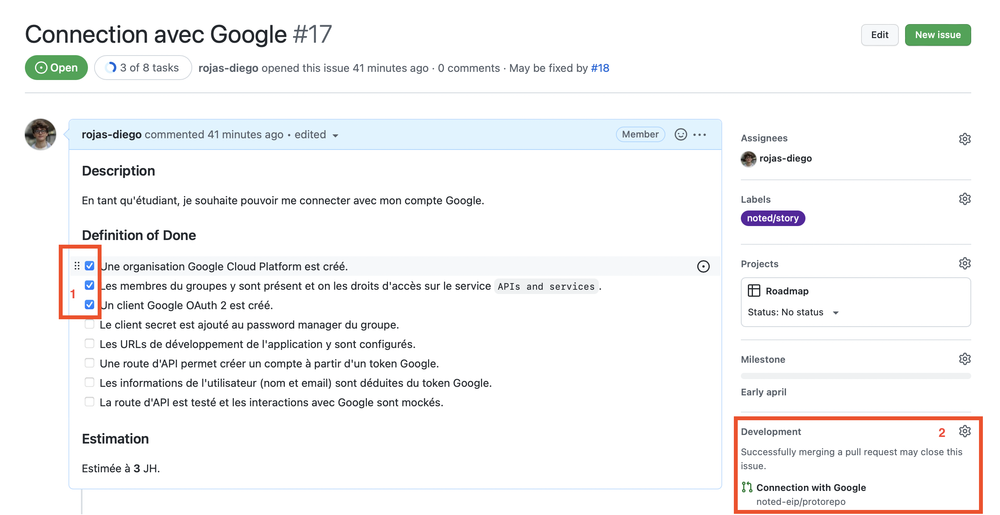
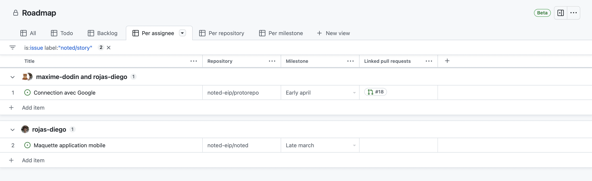

# Contributing Guidelines

This set of guidelines is common to all repositories in the Noted organization.

> **Warning**: Some screenshots of the organisation flow may show outdated information. Refer to what is written in this document first.

## Project Management

In order to frictionlessly roll out new features and maintain satisfactory productivity levels despite the distance, it's crucial that we organize ourselves and plan our work collectively.

> 💡 This specification aims to
> 
> - Transparently show what work is being done, by who, for when
> - Be simple and native to Github
> - Limit administrative work (maintaining todo-lists, updating statuses, etc)

### Stories

This step is to be executed during the inter-sprint period. During this time, the PLD must be redacted and all the stories that will be completed during this sprint must be defined.

Each story must be defined as a Github issue. When creating an issue in any repository whithin the `noted-eip` organization, you should have the option to create a story issue.

After selecting the `Story` template, fill in the information as indicated by the template. By the end, your story should look something like the following.

Make sure your issue meets the following criteria:

1. There is a title which sums up the scope of this story.
2. The people who are going to work on this story during the sprint are assigned to the issue.
3. The issue has the `noted/story` label. This should be automatic.
4. The issue belongs to the `Roadmap` project. This is explained in the section on projects.

If you want to create a story for a later sprint, follow the same steps but use the `Backlog` issue template.

## Pull Requests

As soon as you start working on an story, create a new branch, open a pull request and link it to your issue. If you're unsure how to do this, check out this [guide](https://docs.github.com/en/issues/tracking-your-work-with-issues/linking-a-pull-request-to-an-issue).

Here is what your issue should look like during development.

Make sure the issue is linked to its associated pull request.

> 💡 If the scope of your story is big, feel free to create multiple pull requests for a single story. In this case, don't link the PR to the story issue otherwise it will be merged as soon as your first PR is merged.

### Projects

Github projects™️ allow you to visualize issues and pull requests from many repositories within an organization. We rely on a project called `Roadmap` to view all the stories for a given sprint.

If you have successfuly linked your `noted/story` issue to the project, you shouldn't have to perform any manual action on the project. You should be able to see all stories and their status.

You can filter stories by repository, assignee, todo, and more.

### Weekly Meetings

During weekly meetings, we have access to the `Roadmap` Github project which gives us a high level view of our progress for the sprint. We can go over each item, check how many tasks were completed for this story, check the advancement through linked pull requests and determin if some stories have gone past their due dates. 
